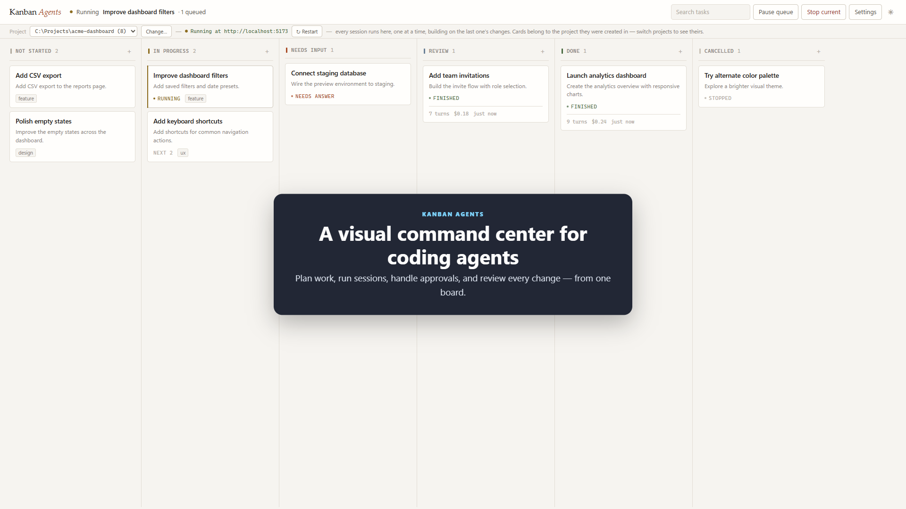

# Kanban Agents

[](demo/kanban-agents-demo.mp4)

[Watch the demo video](demo/kanban-agents-demo.mp4)

A Trello-style board that schedules Claude Code or Codex sessions. Drag a card into
**In Progress** and it runs. Cards run **strictly one at a time per project**,
so tasks sharing a working directory build on previous changes instead of
fighting, while independent projects can run concurrently.

## Run it

```bash
npm run setup
```

```bash
npm start
```

Then open <http://localhost:4317>.

`npm start` builds the web app and serves it from the API server on one port.
For UI work, run the two halves separately instead — `npm run server` in one
terminal and `npm run web` in another (Vite on :5317, proxying to :4317).

```bash
npm run status
```

Reports whether the server is running and at which URL, without needing its
console output — reads the pid/port dropped in the data dir on startup, checks
the process is still alive, and confirms it's actually answering on `/api/health`.

### Authentication

Both agents use their CLI's saved subscription login; the board does not ask
for or store API keys.

- **Claude Code:** run `claude` in a terminal and sign in.
- **Codex:** after `npm run setup`, run `npm run login:codex` and choose
  **Sign in with ChatGPT**. The bundled Codex CLI and the board reuse that
  cached login.

Choose the agent in **Settings**. Existing sessions stay pinned to the agent
and model that created them, so they remain resumable after the board default
changes. Resetting a card starts a fresh session with the current defaults.
For Codex, leave the model on **Codex configured default** unless you know a
specific model is available to your signed-in account; Codex will otherwise
choose its configured or recommended available model.

## The columns

| Column | What it means |
| --- | --- |
| **Not Started** | Drafted, not queued. Nothing runs here. |
| **In Progress** | The run queue. The top card runs; the rest wait their turn. |
| **Needs Input** | The session is blocked on you — a permission prompt, a question, an error, or a stop. |
| **Review** | Finished successfully; you haven't checked it yet. |
| **Done** | Checked and accepted. |
| **Cancelled** | Not doing it. Moving a card here stops it and reverts the filesystem changes made by its session. |

## How the queue works

Exactly one session may run at a time in each project. Different projects can
run concurrently. Within a project, when a session ends, the next card in
**In Progress** starts — so their order is their execution order, and each one
sees the working tree the previous card left.

Each project's queue holds while one of its cards sits in **Needs Input** (a
setting you can turn off). That is deliberate: starting the next task on a tree
that a blocked task left half-finished is how you get conflicts.

- **Pause queue** stops new cards from starting; the running one finishes.
- **Stop current** interrupts the running session and parks it in Needs Input.

## Cards

Click a card to open it.

- **Session** — the live transcript. Assistant text streams token by token; tool
  calls are collapsible with their inputs and outputs; thinking blocks are
  foldable. The reply box sends into a *running* session immediately. Reply to a
  *finished* card and it resumes that same session from the front of the queue.
- **Task** — the prompt, plus per-card overrides for model, permission mode,
  effort, working directory, and labels. Blank means "use the board default".
- **Changes** — the final summary, git branch and commit before/after, and a
  diffstat of what the session actually touched.

### Needs Input

When Claude Code asks for a permission it doesn't have, the card moves itself to
Needs Input and the session **stays open**, waiting. Approve or deny it from the
card and the session picks up where it left off and the card slides back to
In Progress. `AskUserQuestion` works the same way, with the options rendered as
buttons.

The default permission mode is `acceptEdits` — file edits go through and Claude
commands ask. Set a card (or the board) to `bypassPermissions` for fully
unattended runs, or `plan` to have the agent write a plan without touching
anything.

Codex runs non-interactively: normal permission modes map to its safe
`workspace-write` sandbox, `plan` maps to `read-only`, and
`bypassPermissions` maps to unrestricted filesystem access. A Codex action
outside its sandbox is denied; reply on the card with guidance (or change the
mode and reset it) to continue.

### Dictation

Every text field that feeds the queue — the quick-add box on each column, the
reply composer, and the answer/deny-reason fields in Needs Input — has a 🎤
button next to it. Click it, talk, click again (or it keeps listening until
you do). Finished phrases are appended to the field as text; nothing is sent
until you press the field's own button, so you can review or edit before
submitting.

This uses the browser's built-in Web Speech API (no server support or extra
dependency involved), so it needs Chrome or Edge, and the browser will ask for
microphone permission the first time. Note that those browsers typically send
the audio to their vendor's speech service to transcribe it — this isn't a
fully offline/local transcription. The 🎤 button disables itself with an
explanatory tooltip in browsers that don't support it.

## Projects

The board is scoped to one project (working directory) at a time. Every card
is pinned to the project it was created in - via the board's default working
directory at the time, or its own working-directory override - and only that
project's cards are shown.

Switch projects from the dropdown in the bar under the header, or by changing
the working directory in Settings. The columns and visible running card follow.
Each project owns its own execution slot, so work in another project can continue
without blocking the board you are viewing.

## Settings

Board defaults for agent, working directory, model, permission mode, and effort; where
a finished card lands (Review or Done); a max-turns cap; whether the queue holds
on Needs Input; and an extra system prompt appended to every session — useful
for standing rules like "always run the test suite before you finish".

## Data

Everything lives in `~/.kanban-agents`:

- `board.json` — cards and settings
- `logs/<card-id>.jsonl` — one transcript per card
- `run.json` — pid, port, and URL of the currently running server; written on
  startup, removed on clean shutdown, read by `npm run status`

Set `KANBAN_DATA_DIR` to move it, `PORT` to change the port. Session transcripts
are also written by the selected agent: Claude under `~/.claude/projects` and
Codex under `~/.codex/sessions`. A card's session can therefore be resumed from
the matching CLI too.

If the server dies mid-session, the card is requeued on the next start.

## Layout

```
server/src/
  index.js    HTTP + SSE API
  runner.js   per-project queues and Claude/Codex session drivers
  store.js    JSON board + JSONL transcripts
  git.js      before/after snapshots and diffstat
  status.js   `npm run status` — is the server running, and where
web/src/
  App.jsx           board, columns, drag and drop
  CardDetail.jsx    transcript, permissions, reply, per-card settings
  SettingsDialog.jsx
  MicButton.jsx     mic-to-text dictation, shared by every text field
```
